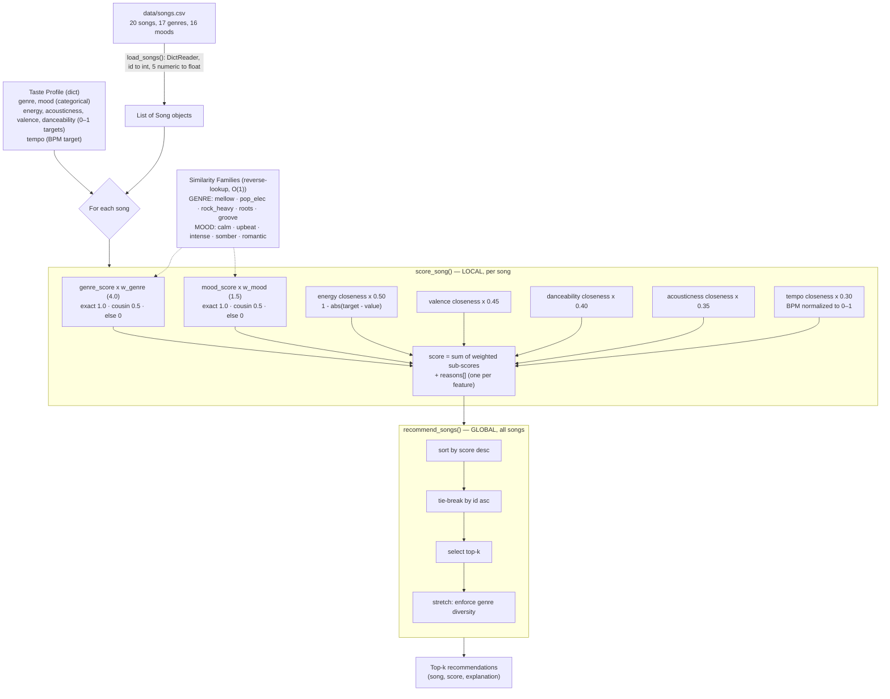
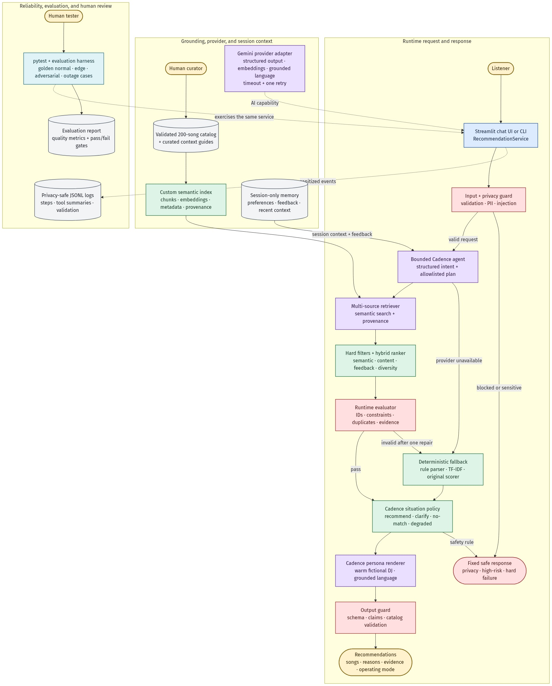

# 🎵 Music Recommender Simulation

## Project Summary

In this project you will build and explain a small music recommender system.

Your goal is to:

- Represent songs and a user "taste profile" as data
- Design a scoring rule that turns that data into recommendations
- Evaluate what your system gets right and wrong
- Reflect on how this mirrors real world AI recommenders

The original project is a deterministic, content-based recommender over a
20-song fictional catalog. The applied-AI extension is being built
incrementally around that trusted scoring core. Its first completed foundation
adds strict runtime contracts and a shared `RecommendationService`, so the CLI,
future Streamlit UI, AI agent, and evaluation harness all use the same validated
application path. Feature 2 expands the authoritative catalog to **200 fictional
tracks across 20 evenly represented genres** and adds retrieval-ready
descriptions, tags, contexts, instruments, content flags, and era metadata. The
original 20 records remain preserved and regression-tested. Features 3, 3b, and 4 add
the **retrieval** half of RAG — a local, dependency-free TF-IDF retriever over the
catalog, a second source of curated context guides that expand a query toward
catalog vocabulary, and Gemini **embeddings with hybrid (semantic + lexical)
ranking** — all behind one `Retriever` interface, with provenance, an honest
fallback, and a before/after demo.

For the complete research, decisions, roadmap, architecture status, teaching
notes, and new-chat recovery prompt, see the
[Project Handbook](docs/PROJECT_HANDBOOK.md). Dataset provenance and review are
documented in the [Catalog Data Card](docs/CATALOG_DATA_CARD.md).

---

## How The System Works

Real-world recommenders are usually hybrids of content-based and collaborative
filtering. This simulation is purely **content-based**: it scores each song by
how closely its attributes match a single user's taste profile, using no data
about other users.

**Taste profile** — a small set of targets:

- `genre`, `mood` — categorical preferences (matched case-insensitively)
- `energy`, `acousticness`, `valence`, `danceability` — numeric targets on a 0–1 scale
- `tempo` — a target in **BPM** (normalized to 0–1 internally over a 50–200 range)

Inside the legacy scorer, every field is optional and a missing field
contributes 0. The public `RecommendationRequest` now requires at least one
preference so an empty request cannot silently return arbitrary catalog order.

**Song features currently scored:** genre, mood, energy, acousticness, valence,
danceability, tempo. The deterministic score still uses only those numeric and
categorical fields. As of Feature 3, the rich text metadata (`description`,
`tags`, `contexts`, `instruments`) is consumed by a separate local TF-IDF
**retriever** — see *Local retrieval (Feature 3)* below. Keeping retrieval out of
the scoring core preserves a clean baseline for measuring whether retrieval
improves behavior.

### Algorithm recipe

Each song earns points from six weighted sub-scores. Every sub-score is 0–1
*before* its weight is applied:

| Feature | How it's matched | Weight |
|---|---|---|
| genre | exact 1.0 · same family 0.5 · else 0 | **4.0** |
| mood | exact 1.0 · same family 0.5 · else 0 | 1.5 |
| energy | closeness = 1 − abs(target − value) | 0.50 |
| valence | closeness | 0.45 |
| danceability | closeness | 0.40 |
| acousticness | closeness | 0.35 |
| tempo | closeness on BPM normalized to 0–1 | 0.30 |

```
score = 4.0*genre + 1.5*mood + 0.50*energy + 0.45*valence
      + 0.40*danceability + 0.35*acousticness + 0.30*tempo
```

The numeric weights share a deliberately small **2.0 total budget** so they
*fine-tune* the order within a genre rather than competing with it.

**Similarity families** give partial credit for "cousin" genres and moods, so the
system degrades gracefully — a lofi listener sees ambient/jazz before metal
instead of a hard zero for everything non-lofi:

- Genre families: `mellow` · `pop_elec` · `rock_heavy` · `roots` · `groove`
- Mood families: `calm` · `upbeat` · `intense` · `somber` · `romantic`

**Why genre is weighted 4.0.** Genre is the decisive signal, and the weights
make that *provable* rather than hopeful. The invariant is:

```
W_genre (4.0)  >  W_mood (1.5) + Σ(numeric weights) (2.0)  =  3.5
```

An unrelated-genre song earns 0 genre points, so the most it can ever reach is
mood + all numerics = 3.5. An exact-genre song banks 4.0 up front. Therefore
**any exact-genre match outranks any unrelated-genre song**, no matter how well
its mood and audio features line up. (An earlier design weighted genre at 3.0
with a 3.5 numeric budget, which let a perfectly-tuned metal track top a lofi
profile — see *Experiments You Tried*.) Cousins (0.5 × 4.0 = 2.0) can still
overtake a *weak* exact match when overall fit is strong, which is the graceful
degradation we want; the strict guarantee only applies to genuinely unrelated
genres.

**Local scoring vs. global ranking.** `score_song` is *local* — it looks at one
song and returns `(score, reasons)`. `recommend_songs` is *global* — it scores
every song, sorts by score descending, breaks ties by `id`, and returns the
top-k. (Stretch: enforce genre diversity within the top-k.)

### Validated service boundary

The CLI no longer calls the scorer directly. Its current path is:

```text
RecommendationRequest
    → RecommendationService
    → original recommend_songs ranking
    → RecommendationResult
```

Pydantic contracts reject empty requests, unknown fields, invalid numeric
ranges, NaN/infinity, boolean values disguised as numbers, duplicate catalog
IDs or normalized title/artist pairs, schema drift, malformed metadata, and
malformed tracks. The service returns both the unchanged raw score and a
normalized **match strength**. Match strength is a request-relative fit score,
not a probability or statistical confidence.

### Local retrieval (Feature 3)

The numeric scorer compares *numbers*; it cannot use a phrase like "late-night
study beats." Feature 3 adds the **retrieval** half of RAG — with no language
model — as a standalone component in [`src/retrieval.py`](src/retrieval.py):

- **TF-IDF + cosine similarity, pure Python (no scikit-learn/NumPy).** Each
  track's descriptor fields (`genre`, `mood`, `era`, `description`, `tags`,
  `contexts`, `instruments`) become one retrieval document. Terms are weighted by
  frequency in the track (TF) and rarity across the catalog (IDF), then compared
  to a query by cosine similarity. The math is written out so it is inspectable.
- **Provenance on every hit.** Each result records `source_type`, `source_id`,
  `content_hash`, `fields_used`, the similarity `score`, and the `matched_terms`
  that justified it (contracts in [`src/contracts.py`](src/contracts.py)).
- **Hard filters before ranking.** `instrumental_only` and `exclude_explicit`
  define the candidate set first, so a high similarity can never override a hard
  constraint.
- **A stable `Retriever` interface.** `TfidfRetriever` implements an abstract
  `Retriever`, so a future provider-embedding retriever can drop in behind the
  same `search()` method.

**Honesty boundary.** The public `RecommendationRequest` still accepts *only*
structured preferences — there is deliberately no natural-language `query` field
yet. That entry point arrives with the input/privacy guard and intent parser in a
later phase. The retriever is exercised directly by tests and the demo below.

**Limitation by design.** TF-IDF is *lexical*, not semantic: it matches word
forms, so `"studying"` does not match the catalog's `"study"`. Context guides
(below) bridge *some* of that gap; fully closing it is the job of the planned
provider-embedding retriever.

### Multi-source retrieval: context guides (Feature 3b)

The catalog is one retrieval source. Feature 3b adds a **second source** —
curated, human-readable **context guides** in
[`data/context_guides/`](data/context_guides/), one Markdown file per situation
(Studying & Focus, Workout & Energy, Rainy Day, …). This is what makes the system
*multi-source* RAG.

A guide is **not a recommendable track** — you can't recommend "the Studying
guide" to a listener. Instead a guide does two jobs:

- **Query expansion (bridging vocabulary).** A listener types `"music to
  concentrate"`. No track contains the word "concentrate," so catalog-only
  retrieval returns **nothing**. But the *Studying & Focus* guide does, so
  matching it lets us fold *its* catalog-vocabulary terms (`study`, `focus`,
  `coding`) into the query — which then retrieves the right lofi tracks. A
  dominance threshold keeps a weak, off-topic guide from bleeding in.
- **Cited evidence.** Each fired guide is recorded in the result's `guides_used`
  (with `source_type`, `content_hash`, its `matched_terms`, and the exact
  `expansion_terms` it contributed), so every result stays traceable.

Guides never appear in the recommendation list — only in the evidence. The
`data/context_guides/*.md` text is **AI-drafted and pending curator review**,
since a guide encodes judgment about what music is "for."

### Meaning: embeddings + hybrid ranking (Feature 4)

TF-IDF and guides are still *lexical*. Feature 4 adds **meaning** with Gemini
embeddings (`src/embeddings.py`) — the first feature that calls an external AI —
so `"tunes for cramming before an exam"` can match study tracks that share **no**
words with the query. A `HybridRetriever` blends the semantic score with the
TF-IDF score (configurable weights, default 0.6/0.4), and every hit records both
sub-scores.

The design keeps a live API from hurting reproducibility:

- **Committed vector cache.** Track embeddings are computed once
  (`scripts/build_embeddings.py`) and saved to `data/embeddings/`, keyed on the
  catalog content plus the model and dimension. Anyone reproduces the exact
  semantic index from the committed file with **no key**.
- **Deterministic fake for tests.** The whole suite runs offline via a
  `FakeEmbedder`; live calls are never in the test path.
- **Honest fallback.** No key, no cache, or a provider error → the hybrid
  degrades to TF-IDF and labels the result `DEGRADED` (via `operating_mode`),
  never pretending semantic ran.
- **Optional, lazy dependency.** `google-genai` is imported only on the real
  path (`requirements-embeddings.txt`), so the core installs and tests without it.

The key is read only from `GEMINI_API_KEY` in a git-ignored `.env` — never code,
logs, or commits.

### Original scoring diagram



### Applied AI target architecture

The implementation roadmap is captured in the canonical
[Mermaid source](diagrams/architecture.mmd). It will be kept synchronized with
the code as each feature is implemented. A rendered
[PNG preview](assets/architecture.png) is included for convenience; the Mermaid
file is the authoritative submission artifact.



### Potential biases and risks

- **Filter-bubble / genre lock-in.** Content-based scoring with a heavy genre
  weight (4.0) strongly favors the user's stated genre and its family, so
  genuinely good cross-genre songs rarely surface. Raising genre from 3.0 to 4.0
  to guarantee genre-dominance *deepens* this trade-off: it buys a provable
  "genre is decisive" rule at the cost of even less serendipity.
- **Subjective family groupings.** The genre/mood families are hand-authored
  judgment calls (e.g., jazz sits with lofi/ambient in *mellow*; reggae with hip
  hop in *groove*). They encode the designer's cultural assumptions; a listener
  who hears jazz as closer to blues is systematically mis-served.
- **Uneven family sizes.** Larger families offer more partial-credit paths, so
  their songs are structurally easier to recommend. The singleton *romantic* mood
  earns cousin credit for nothing but an exact match, while an *upbeat* song (5
  members) picks up 0.5 far more often — an advantage unrelated to real fit.
- **Symmetric-closeness assumption.** `1 − abs(target − value)` penalizes
  exceeding a target exactly as much as falling short. "I want high energy" is not
  the same as "I want energy near 0.9," but the model treats them identically.
- **Synthetic catalog.** The new 200-track catalog fixes representation depth for
  software testing, but its features and descriptions are authored rather than
  measured from audio. Embedding this metadata will make its assumptions easier
  to retrieve, not more objective.

(The model card goes deeper on these.)

---

## Getting Started

### Setup

1. Create and activate a virtual environment:

   ```bash
   python3 -m venv .venv
   source .venv/bin/activate      # Mac or Linux
   .venv\Scripts\activate         # Windows
   ```

2. Install dependencies:

   ```bash
   pip install -r requirements.txt
   ```

3. Run the app:

   ```bash
   python3 -m src.main
   ```

4. Try retrieval (Features 3 / 3b / 4) — no API key or network needed:

   ```bash
   python3 scripts/retrieval_demo.py "music to concentrate"
   ```

   Retrieval needs no dependencies beyond the standard library. Without an
   embedding cache the semantic panel honestly degrades to TF-IDF.

5. *(Optional)* Enable the real semantic path with a Gemini key:

   ```bash
   cp .env.example .env            # then paste your key into .env (git-ignored)
   pip install -r requirements-embeddings.txt
   python3 scripts/build_embeddings.py   # writes data/embeddings/, then commit it
   ```

   The key is read only from `.env`; never commit it or paste it into chat.

### Running Tests

Run all tests with:

```bash
python3 -m pytest
```

The current suite contains 70 tests covering the original scorer, validated
contracts, compatibility, normalization, malformed input, 200-track balance,
legacy preservation, retrieval-metadata integrity, schema drift, new-genre
service behavior, non-mutation, TF-IDF retrieval relevance, provenance, hard
filters, determinism, tie-breaking, no-signal queries, index fingerprinting,
and — new in Feature 3b — context-guide loading and validation, guide-driven
query expansion, expansion provenance, the dominance threshold, the
guides-as-evidence-not-recommendations rule, a fingerprint that covers both
sources' content and the expansion settings, and — new in Feature 4 — the
embedding cache, semantic and hybrid retrieval, the exact blend math, honest
`DEGRADED` fallback, and the query cache. Every test runs fully offline (no key).

---

## Sample Recommendation Output

Running the app with the built-in "focus / study" taste profile:

```bash
python3 -m src.main
```

produces:

```
🎵  Music Recommender — your top picks

Taste profile: genre=lofi, mood=chill, energy=0.4, acousticness=0.8, valence=0.55, danceability=0.4, tempo_bpm=78.0
Operating mode: local
----------------------------------------------------------------
1. Cloudy Bookmark — Mosslight  [lofi · chill]
   Raw score: 7.38  ·  Match strength: 98%
   Why:
     • genre match (lofi) +4.00
     • mood match (chill) +1.50
     • energy fit (target 0.4, song 0.48) +0.46
     • acousticness fit (target 0.8, song 0.8) +0.35
     • valence fit (target 0.55, song 0.56) +0.45
     • danceability fit (target 0.4, song 0.53) +0.35
     • tempo fit (target 78 bpm, song 88 bpm) +0.28
----------------------------------------------------------------
2. Midnight Coding — LoRoom  [lofi · chill]
   Raw score: 7.37  ·  Match strength: 98%
   Why:
     • genre match (lofi) +4.00
     • mood match (chill) +1.50
     • energy fit (target 0.4, song 0.42) +0.49
     • acousticness fit (target 0.8, song 0.71) +0.32
     • valence fit (target 0.55, song 0.56) +0.45
     • danceability fit (target 0.4, song 0.62) +0.31
     • tempo fit (target 78 bpm, song 78 bpm) +0.30
----------------------------------------------------------------
3. Library Rain — Paper Lanterns  [lofi · chill]
   Raw score: 7.35  ·  Match strength: 98%
   Why:
     • genre match (lofi) +4.00
     • mood match (chill) +1.50
     • energy fit (target 0.4, song 0.35) +0.47
     • acousticness fit (target 0.8, song 0.86) +0.33
     • valence fit (target 0.55, song 0.6) +0.43
     • danceability fit (target 0.4, song 0.58) +0.33
     • tempo fit (target 78 bpm, song 72 bpm) +0.29
----------------------------------------------------------------
4. Blue Desk Lamp — Juniper Tape  [lofi · relaxed]
   Raw score: 6.67  ·  Match strength: 89%
   Why:
     • genre match (lofi) +4.00
     • mood cousin of chill (relaxed) +0.75
     • energy fit (target 0.4, song 0.4) +0.50
     • acousticness fit (target 0.8, song 0.72) +0.32
     • valence fit (target 0.55, song 0.48) +0.42
     • danceability fit (target 0.4, song 0.45) +0.38
     • tempo fit (target 78 bpm, song 80 bpm) +0.30
----------------------------------------------------------------
5. Quiet Deadline — Cassette Garden  [lofi · focused]
   Raw score: 6.65  ·  Match strength: 89%
   Why:
     • genre match (lofi) +4.00
     • mood cousin of chill (focused) +0.75
     • energy fit (target 0.4, song 0.44) +0.48
     • acousticness fit (target 0.8, song 0.76) +0.34
     • valence fit (target 0.55, song 0.6) +0.43
     • danceability fit (target 0.4, song 0.49) +0.36
     • tempo fit (target 78 bpm, song 84 bpm) +0.29
----------------------------------------------------------------
```

**Screenshot or video** *(optional)*: <!-- Insert a screenshot or demo video link here -->

### Retrieval before / after (Features 3 / 3b)

`scripts/retrieval_demo.py` contrasts three stages on a free-text phrase the
scorer cannot represent and whose key word (`concentrate`) appears in **no**
track:

```bash
python3 scripts/retrieval_demo.py "music to concentrate"
```

```
BEFORE - original numeric scorer
  Free text has nowhere to go; ranking falls back to stable ID order:
  #  1  Sunrise City               [pop      ] match strength 0.00
  #  2  Midnight Coding            [lofi     ] match strength 0.00
  ...

THEN - TF-IDF over the catalog alone  (mode: local, index 5dc9493a2e80)
  (no lexical overlap with the catalog - retriever reports no signal)

NOW - + curated context guides (query expansion)  (mode: local, index 5dc9493a2e80)
  guide fired: 'Studying and Focus'  (score 0.126)  expanded query with: focus, best, gentle, piano
  # 29  Margin Doodles             [lofi     ] similarity 0.220
        source=catalog:29  matched: gentle, focus, piano
  # 33  Late Bus Home              [lofi     ] similarity 0.220
        source=catalog:33  matched: gentle, focus, piano
  #  9  Focus Flow                 [lofi     ] similarity 0.205
        source=catalog:9  matched: gentle, focus, piano
  ...
```

The second source turns a dead query into relevant results: the *Studying &
Focus* guide bridges "concentrate" to catalog vocabulary, and the guide is cited
as evidence rather than shown as a recommendation. Catalog-only retrieval also
reaches matches no single-genre request could — `"rainy day melancholy piano"`
surfaces blues, r&b, and classical tracks together, each with the `matched_terms`
that justify it.

---

## Experiments You Tried

### Historical baseline adversarial profiles

Before the validated service and catalog expansion, I pressure-tested the
20-song scoring baseline with deliberately hostile taste profiles. The blocks
below are preserved as historical evidence of what failed and why the later
changes were made; they are not claims about the current public service.

**1. "Genre is decisive" is conditional — a wrong-genre song can top the list.**
The genre weight is 3.0, but *everything except genre* sums to 5.0 (mood 1.5 +
numeric 1.0+1.0+1.0+0.5). So an off-genre song that collects mood + numeric
points can outrank an exact-genre match. Profile B is a coherent-looking user
("I like the lofi genre but an aggressive mood") whose #1 pick is a **metal**
track — above every lofi song. Profile A is the control: same numerics, but a
mood no intruder can claim, so genre holds.

```
A) genre=lofi, mood=romantic, energy=0.97, acousticness=0.03, valence=0.30, danceability=0.42
  1. Midnight Coding      [lofi/chill]        score=4.91
  2. Focus Flow           [lofi/focused]      score=4.80
  3. Library Rain         [lofi/chill]        score=4.67

B) genre=lofi, mood=aggressive, energy=0.97, acousticness=0.03, valence=0.30, danceability=0.42
  1. Iron Verdict         [metal/aggressive]  score=5.00   <-- wrong genre wins
  2. Midnight Coding      [lofi/chill]        score=4.91
  3. Focus Flow           [lofi/focused]      score=4.80
```

**2. No input validation — garbage numeric targets are silently zeroed.**
`closeness = max(0, 1 - abs(target - value))` clamps to 0 for any out-of-range
target, so typos raise no error and give no warning. The recommender quietly
drops *all* numeric signal and falls back to categorical-only (scores cap at
4.50 = genre 3.0 + mood 1.5). Garbage in, silent degradation.

```
C) genre=lofi, mood=chill, energy=9000, acousticness=-5, valence=50, danceability=1e9
  1. Midnight Coding      [lofi/chill]     score=4.50   (numeric contribution: 0)
  2. Library Rain         [lofi/chill]     score=4.50
  3. Focus Flow           [lofi/focused]   score=3.75
```

**3. Categorical matching is case-sensitive — an exact favorite can be ignored.**
Genre/mood use exact string equality, so `"Lofi"` != `"lofi"`. Capitalizing
the favorite makes the recommender behave as if genre and mood were never
specified; ranking collapses to numerics only, and a **folk** song ties the top
lofi track. The user typed their exact favorite and it was silently discarded.

```
D) genre=Lofi, mood=Chill, energy=0.40, acousticness=0.80, valence=0.55, danceability=0.40
  1. Focus Flow           [lofi/focused]   score=3.34
  2. Midnight Coding      [lofi/chill]     score=3.27
  3. Paper Compass        [folk/hopeful]   score=3.27   <-- folk ties lofi
```

**4. No "nothing matches" signal — an empty profile looks like a real answer.**
When nothing matches, every song scores 0.00 and the "top picks" are just the
lowest-`id` songs in catalog order (the tie-break is `id` ascending). An empty
profile `{}` is indistinguishable from a completely wrong one, and the app
presents catalog order as confident recommendations.

```
E) genre=polka, mood=spicy, energy=500, acousticness=500, valence=500, danceability=500
  1. Sunrise City         [pop/happy]      score=0.00
  2. Midnight Coding      [lofi/chill]     score=0.00
  3. Storm Runner         [rock/intense]   score=0.00

F) {}  (empty profile)
  1. Sunrise City         [pop/happy]      score=0.00   (identical to E — just id order)
  2. Midnight Coding      [lofi/chill]     score=0.00
  3. Storm Runner         [rock/intense]   score=0.00
```

**Other gaps surfaced.** `tempo_bpm` is loaded from the CSV but never scored,
and `UserProfile` has no `target_tempo`, so a tempo-driven listener is unserved.
Ties always resolve to the lowest `id`, a systematic bias whenever scores bunch
up. None of these raise errors — the failure mode throughout is *silent*.

### What we changed in response

The tuning pass (genre 3.0 → 4.0, numeric budget 3.5 → 2.0, tempo added,
case-insensitive matching) fixes the ranking-level failures:

- **Finding 1 is gone.** Re-running profile **B** now returns lofi songs in the
  top 3 — the metal track can no longer win, because the invariant
  `W_genre (4.0) > W_mood + numerics (3.5)` guarantees any exact-genre song
  beats any unrelated-genre one.

  ```
  B) genre=lofi, mood=aggressive, energy=0.97, acousticness=0.03, valence=0.30, danceability=0.42
    1. Midnight Coding      [lofi/chill]     score=4.99
    2. Focus Flow           [lofi/focused]   score=4.95
    3. Library Rain         [lofi/chill]     score=4.90
  ```

- **Finding 3 is gone.** Matching is now case/whitespace-insensitive, so profile
  **D** (`"Lofi"`/`"Chill"`) recovers the full genre + mood match (7.07) instead
  of silently collapsing to numerics.

- **Finding 2 is gone at the public boundary.** `RecommendationRequest` rejects
  out-of-range values, booleans disguised as numbers, NaN, and infinity before
  the scorer runs. Tempo is now scored.

- **The empty-profile half of Finding 4 is gone.** The public contract requires
  at least one real preference. An unknown but syntactically valid all-miss
  genre can still return zero-score ID order; the planned situation policy will
  turn that into an explicit no-match or clarification response.

---

## Limitations and Risks

- The scorer strongly favors genre, which protects stated preferences but limits
  cross-genre discovery.
- Genre/mood families and all rich metadata encode human judgment and cultural
  assumptions.
- The 200 tracks are fictional and their numeric values are not measured audio
  properties.
- The public request path does not yet understand natural language; the Feature 3
  retriever is a standalone component, and adding a `query` field before the
  intent/privacy guard exists would misrepresent the application's capability.
- Semantic quality depends on the real embedding cache (a rotated key runs
  `scripts/build_embeddings.py`); without it the hybrid degrades to lexical
  TF-IDF and labels the result `DEGRADED`. The test-time `FakeEmbedder` captures
  no real meaning.
- Match strength is not calibrated confidence, retrieval similarity is not a
  probability, and a valid unknown genre can still produce zero-score stable ID
  order.
- **Cloud-AI disclosure:** the optional embedding path sends catalog document
  text and query text to Google's Gemini API. Under the free-tier terms, that
  content may be used to improve products and reviewed by humans, so no secrets
  or personal data should be embedded. The app runs fully locally without a key.
- Companion behavior, provider privacy controls, and grounded output evaluation
  are target features, not current behavior.

See the [Model Card](model_card.md), [Catalog Data Card](docs/CATALOG_DATA_CARD.md),
and [Project Handbook](docs/PROJECT_HANDBOOK.md) for deeper analysis.

---

## Reflection

The most important engineering lesson so far is that an AI feature needs a
trustworthy application boundary and trustworthy source data before it needs a
language model. The original weighted scorer remains valuable because it is
deterministic and explainable. Pydantic validation now protects inputs and
outputs, while the balanced catalog provides enough rich evidence for us to
measure RAG instead of merely demonstrating an API call.

The catalog expansion also makes bias easier to see. Equal genre counts improve
test coverage, but do not make our genre families, contexts, descriptions, or
numeric labels objective. Future retrieval could amplify those authored
assumptions. That is why the data card separates automated integrity checks from
pending human review, and why the final evaluator must check provenance and hard
constraints rather than trusting fluent AI output.
